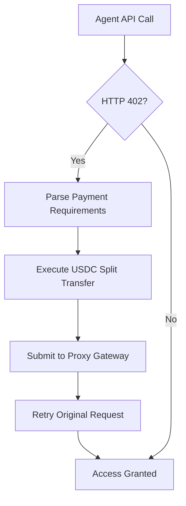

# X402 Facilitator Proxy - Multi-Tenant Payment Gateway

**A decentralized, autonomous payment infrastructure for API monetization on Base L2 with programmatic fee routing and agent-compatible settlement protocols.**

## 🏗️ Architecture Overview

The X402 Facilitator Proxy implements a complete multi-tenant payment gateway that enables merchants to monetize APIs through HTTP 402 "Payment Required" responses, while autonomous agents can seamlessly settle transactions using USDC on Base L2.

```
x402-facilitator-proxy/
├── src/                                    # Core Cloudflare Worker Engine
│   ├── index.ts                           # Main proxy gateway endpoint
│   └── backend/automation/
│       └── sweeper.ts                     # Automated fee collection
├── x402-client-sdk/                       # Core Interface Rails
│   ├── src/
│   │   ├── client-library.ts             # TypeScript SDK
│   │   └── mcp-server.ts                 # Model Context Protocol Server
│   ├── package.json                      # SDK dependencies
│   └── tsconfig.json                     # TypeScript configuration
└── templates/                             # Integration Templates
    ├── express-middleware/
    │   └── x402-guard.js                 # Merchant-Side API Gating
    ├── langchain-ts/
    │   ├── agent.ts                      # TypeScript Agent Template
    │   ├── package.json                  # LangChain dependencies
    │   └── README.md                     # Setup instructions
    └── crewai-python/
        └── agent.py                      # Python Agent Template
```

## 🚀 Core Components

### 1. Cloudflare Worker Proxy Engine

The core backend (`src/index.ts`) operates as a serverless payment verification gateway deployed on Cloudflare's edge network:

- **Endpoint**: `https://x402-facilitator-proxy.seob5285.workers.dev/api/v1/verify-and-settle`
- **Platform Vault**: `0x2E3DADfb314718849A93c49A78618E586c3b2C60`
- **Fee Structure**: Automated 1% platform fee routing

**Key Features:**
- Multi-tenant transaction verification
- Base L2 USDC settlement validation
- Automated fee splitting (99% to merchant, 1% to platform)
- Edge-deployed for global low-latency access

### 2. Model Context Protocol (MCP) Server

The MCP server (`x402-client-sdk/src/mcp-server.ts`) provides a standardized interface for AI agents to interact with the payment system:

```bash
# Start the MCP server locally via stdio
npm run mcp:start
```

**Protocol Features:**
- Standard I/O communication interface
- Agent-compatible payment tool registration
- Automatic transaction handling and verification
- Cross-platform AI framework compatibility

### 3. Merchant-Side API Gating

The Express middleware (`templates/express-middleware/x402-guard.js`) enables merchants to protect APIs with HTTP 402 challenges:

```javascript
import { x402TollboothGuard } from './templates/express-middleware/x402-guard.js';

app.use('/api/premium', x402TollboothGuard("0.10", "0xYourWalletAddress"));
```

**Middleware Behavior:**
1. **Challenge**: Returns HTTP 402 with payment instructions when headers are missing
2. **Verification**: Validates payment through the proxy gateway
3. **Access**: Grants API access upon successful payment verification

### 4. Autonomous Agent Templates

#### TypeScript/LangChain Agent (`templates/langchain-ts/agent.ts`)
```typescript
import { createPaymentAgent } from './templates/langchain-ts/agent.js';

const agent = await createPaymentAgent();
const result = await agent.invoke({
  input: JSON.stringify({
    agentPrivateKey: process.env.AGENT_PRIVATE_KEY,
    developerWallet: "0x742d35Cc6297C24aE0E4838C4667C02693C4cB36",
    amountUSD: "0.10"
  })
});
```

#### Python/CrewAI Agent (`templates/crewai-python/agent.py`)
```python
from templates.crewai_python.agent import X402PaymentAgent

agent = X402PaymentAgent()
result = agent.process_payment({
    "agent_private_key": os.getenv("AGENT_PRIVATE_KEY"),
    "developer_wallet": "0x742d35Cc6297C24aE0E4838C4667C02693C4cB36",
    "amount_usd": "0.10"
})
```

## 🔧 Quick Start

### 1. Deploy the Proxy Engine
```bash
npm install
npm run deploy
```

### 2. Setup the MCP Server
```bash
cd x402-client-sdk
npm install
npm run mcp:start
```

### 3. Integrate Merchant Middleware
```bash
# Copy the Express middleware to your project
cp templates/express-middleware/x402-guard.js your-project/middleware/

# Install in your Express app
import { x402TollboothGuard } from './middleware/x402-guard.js';
app.use('/api/protected', x402TollboothGuard("0.05", "0xYourWallet"));
```

### 4. Setup Agent Templates
```bash
# For TypeScript/LangChain agents
cd templates/langchain-ts
npm install
npm run dev

# For Python/CrewAI agents
cd templates/crewai-python
pip install -r requirements.txt
python agent.py
```

## 🔐 Security & Environment Variables

### **Critical Security Guidelines**

**⚠️ NEVER HARDCODE PRIVATE KEYS IN REPOSITORY FILES**

All sensitive credentials must be managed through secure environment variables:

### Cloudflare Worker Environment (Production)
```bash
# Set via Cloudflare Workers dashboard or wrangler
wrangler secret put FACILITATOR_PRIVATE_KEY
wrangler secret put PLATFORM_VAULT_ADDRESS
```

### Local Development Environment
Create `.env` files for local testing:

```env
# .env (root directory - for Cloudflare Worker development)
FACILITATOR_PRIVATE_KEY=0x1234567890abcdef...
PLATFORM_VAULT_ADDRESS=0x2E3DADfb314718849A93c49A78618E586c3b2C60

# Agent execution environments
AGENT_PRIVATE_KEY=0xabcdef1234567890...
OPENAI_API_KEY=sk-...
```

### Agent Runtime Security
- **TypeScript Agents**: Use `process.env.AGENT_PRIVATE_KEY`
- **Python Agents**: Use `os.getenv("AGENT_PRIVATE_KEY")`
- **MCP Server**: Loads keys from system environment at runtime

## 🌐 Platform Reference

### Core Infrastructure
- **Verification Gateway**: `https://x402-facilitator-proxy.seob5285.workers.dev/api/v1/verify-and-settle`
- **Platform Vault**: `0x2E3DADfb314718849A93c49A78618E586c3b2C60`
- **Network**: Base L2 (Chain ID: 8453)
- **Payment Token**: USDC (`0x833589fCD6eDb6E08f4c7C32d4f71b54bda02913`)

### Fee Structure
- **Merchant Revenue**: 99% of payment amount
- **Platform Fee**: 1% automatically routed to platform vault
- **Gas Optimization**: Batched transfers for cost efficiency

## 📖 Integration Patterns

### HTTP 402 Payment Flow

1. **API Request**: Client attempts to access protected endpoint
2. **Payment Challenge**: Server responds with HTTP 402 and payment instructions
3. **Agent Processing**: Autonomous agent detects 402, executes USDC payment split
4. **Verification**: Proxy gateway validates on-chain transaction
5. **Access Granted**: Original API request succeeds with payment headers

### Agent Integration Workflow



## 🛠️ Development Commands

```bash
# Core proxy development
npm run dev              # Start local development server
npm run deploy           # Deploy to Cloudflare Workers
npm run cf-typegen       # Generate Cloudflare types

# SDK development
cd x402-client-sdk
npm run build           # Build TypeScript SDK
npm run mcp:start       # Start MCP server

# Template testing
cd templates/langchain-ts
npm run dev            # Test TypeScript agent

cd templates/crewai-python
python agent.py        # Test Python agent

# Automated fee collection
npm run sweep          # Execute fee sweeping automation
```

## 📚 Documentation

- **[Client Integration Guide](CLIENT_INTEGRATION.md)**: Detailed integration instructions
- **[LangChain Template README](templates/langchain-ts/README.md)**: TypeScript agent setup
- **[API Reference](src/index.ts)**: Core gateway endpoints and responses

## 🤝 Contributing

1. Fork the repository
2. Create feature branches for new integrations
3. Test against Base L2 testnet before mainnet deployment
4. Submit pull requests with comprehensive test coverage

## 📄 License

This project is licensed under the MIT License - enabling open-source innovation while maintaining platform sustainability through programmatic fee routing.

---

**Built for the autonomous economy. Powered by Base L2. Secured by multi-tenant verification.**